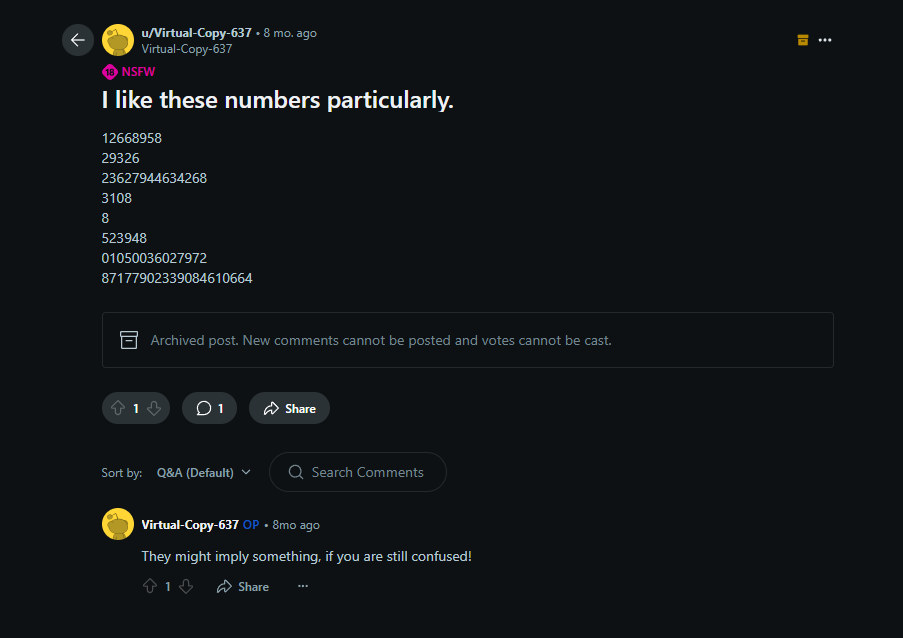
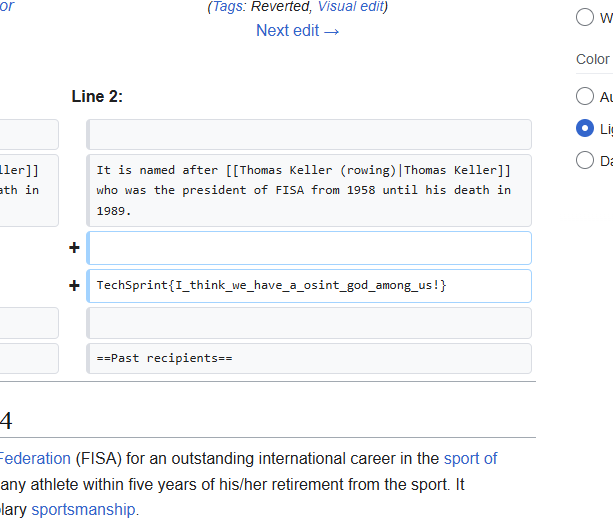
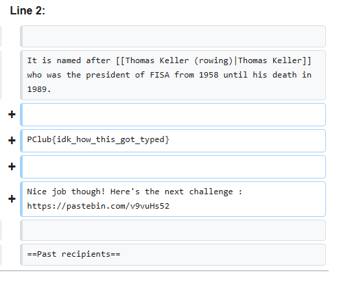
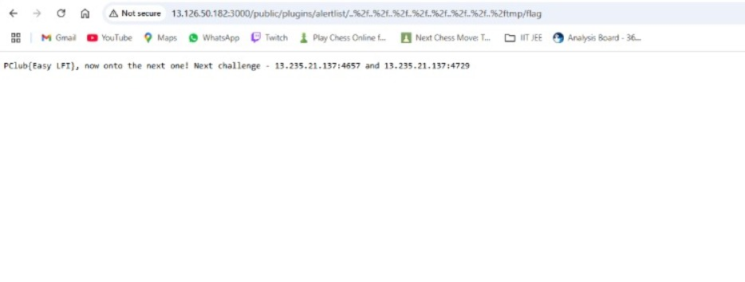
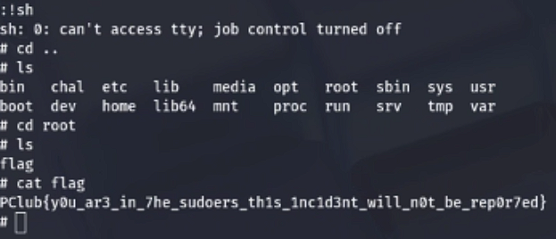
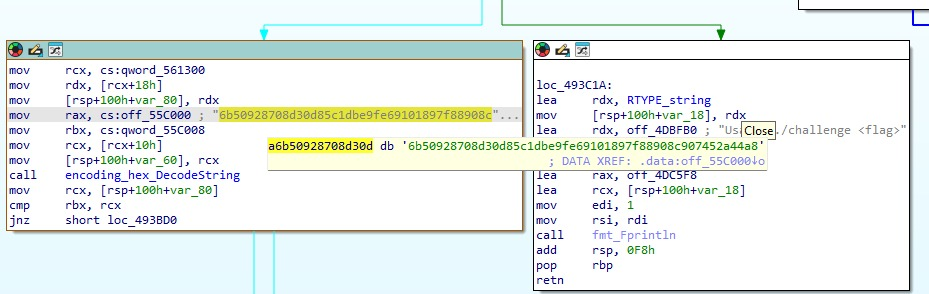

## BY - VISHU KHARE


## FLAG - PClub{idk_how_this_got_typed}

So the author's real name was Kalpit Lal Rama and after checking the source of the page and using inspect element I found nothing.

So I just googled his name which led me to this LinkedIn and there it had a link to a twitter account.

In the bio of that account I found the reddit account u/Virtual-Copy-637 which had a few random rowing posts in which I found nothing after doing steg.

There was this 8 month old post which had these random numbers with a comment hinting to use them.


Upon trying all the permutations of recipes on cyberchef I got frustrated and just put the numbers on dcode.fr cipher analyzer and it gave base 36 as the best option , upon translating got the link for a insta account (https://www.instagram.com/i_like_anonymity_sometimes1212/)

upon analyzing all the posts and the spam highlight(and wasting my 15 mins on the Mahe Drysdale wiki cause the photo was different)I was finally on the Thomas keller medal wiki page.

And since the highlight said - "hope i didn't leak something" thinking Wikipedia is editable i viewed the edit history of the page and taking the date 29th September from the highlight , I saw the edit on that day from user Kapilx19 and clicking on the difference options which shows us the edit between the changed and original site I got this fake flag(Fake cause well all the flags had format PClub{})


I noticed in the edit history another recent edit from a account named KapilLal20 which is similar to our previous user and on viewing its contributions finally found the real flag and clues for the next 2 flags.



## FLAG - PClub{Easy LFI}

Well this one was a nightmare(I used to run away from web).

So my first instinct after opening the website was well /sitemap.xml and /robots.txt which well did not work.

then i thoroughly checked the source and inspected all the related webpages but still nothing.

next I did steg analysis on all the photos available on the whole website and found nothing in them also.

then I found the link for the localhost of grafana and decided to try 1=1 and random break-throughs until user admin and pass admin worked.

When I saw the option to change password for the admin , I was reluctant to do that as I thought that this might destroy the integrity of the challenge but after waking up next day I find myself logged out with the password changed and then I was well ready to war.

Found various grafana vulnerabilities due to it being the older version 8.3.0 and found various CVE's which explained the vulnerabilities 
and I had to basically find a exploit to them. 

Used nmap to scan all the available ports and googled a lot to find ways to use any port if possible.

Used nikto to scan the website and also find any sub-domains which could be of use.

tried sqlmap and burpsuite and still did not get anything(elaborate more on this)

By now I had already found the reddit account used in the OSINT challenge and was busy doing steg and connecting those numbers with rowing statistics and anything that I really saw related to rowing which wasted quite a lot of time.

when i got free from all this and decided to go back to Grafana and found the website was on maintenance and hoped that the server was getting restarted and that there might be a chance for me to use that admin admin credentials again and this time I would be the one who will change the password.

Kept checking constantly and as soon as it came back online i logged in ( thankfully admin credentials were working ) and i changed the password forcing others to try and breach through the login page.

It was not really needed at this point for me to do that cause i had already found a pdf which gave detailed step by step on how to exploit and login but well why not .
(insert ambassador.pdf )

found myself doing random tries after logging in , like looking at cookies and decrypting possibly anything which had (=) in the end 
(i had lost my mind at this point)

At one point i was so close that i had visited (http://13.126.50.182:3000/public/plugins/alertlist/..%2f..%2f..%2f..%2f..%2f..%2f..%2f..%2fetc/passwd/)

but got annoyed and kept trying to still find exploits in plugins or literally anywhere and the breakthrough came with the hint which indicated the temporary directory.

used ffuf to find the number of levels down we have to go to get to the root and when simple path traversal didn't work , did it with .%2f url encoding at finally got the flag after so many days.



## FLAG - PClub{4lw4ys_cl05e_y0ur_fil3s}

Well this challenge was not that hard despite me panicking I managed to do it in like a hour.

first connected to the server with netcat. Then used 'ls' to list all the contents in that directory.

file_chal and file_chal.c came up 

using 'cat' opened file_chal.c and it was this

Then doing 'ls -l' told me the permissions of all the files in the directory 

tried running 'chmod +x file_chal' but it was pointless since the file was already executable.

after re-reading the .c file

```
#include <fcntl.h>
#include <unistd.h>

int main () {
    int fd = open ("/root/flag", 0);

    // Dropping root previliges
    // definitely not forgetting anything
    setuid (getuid ());

    char* args[] = { "sh", 0 };
    execvp ("/bin/sh", args);
    return 0;
}
```

we can see the code is executing a shell, and there is a file descripter involved.
now, we know that 0 -> stdin, 1->stdout, 2->stderr, so running 'cat <&3' gave me the flag.


## FLAG - PClub{y0u_ar3_in_7he_sudoers_th1s_1nc1d3nt_will_n0t_be_rep0r7ed}

Took me the longest time to solve this one :(

Did 'ls' after connecting through netcat and found nothing

So ran 'ls -al' in /chal , saw .swp, .swl etc files, so found out that challenge is related to vim. however all files are owned by root so running 'vim -r <filename>' did not repair them and gave error.

Kept looking around in different directories and wasted a lot of time.

finally ran 'sudo -l' to list the superuser.

got '/bin/vim' as superuser with no password.

ran '/bin/vim' but there were font issues or something(as per gpt), so doing :!sh did not work.

wasted a lot of time on vim and realized there was no point.

force exited from the vim.

ran 'sudo vim -c "!sh"' trying to gain the root access.

after that, tried 'cd ..' trying to go back a directory

did 'ls' and saw root and then decided to go to cd root

did 'ls' saw flag(lfggg!!!!)

'cat flag' gave me the flag.




## FLAG - PClub{Franklin_Reiter_is_cool}

So started off by connecting with netcat to the given server

Got the prompt "Find a string such that SHA-256 hash of "SMJeOh" concatenated with your input starts with the the string "30073"."

and the prompt changed everytime u connected with netcat.

we will now use this code to get the final string

```
import hashlib

def find_string_with_hash_prefix(prefix, base_str="SMJeOh"):
    i = 0
    while True:
        test_str = base_str + str(i)
        hash_result = hashlib.sha256(test_str.encode()).hexdigest()
        if hash_result.startswith(prefix):
            return str(i), hash_result
        i += 1


prefix = "30073"
print("Searching for a string that produces a hash starting with", prefix)

result_str, result_hash = find_string_with_hash_prefix(prefix)

print(f"Found solution: '{result_str}'")
print(f"Hash: {result_hash}")
```

on inputting the answer we get three options whether to get the 1st part of the code or the 2nd part of the code or the flag itself which was just a hoax and the server asked for a padding.

we first get both the parts of the code by connecting with netcat twice and then on the third try we go for the padding

we can encrypt any message with our own padding such that:
c = ((m+p)^3)%n where p is sha256(padding)

If we give two different paddings, we can form two different equations

c1 = ((m+p1)^3) %n
c2 = ((m+p2)^3) %n

Now I assumed ((m+p1)^3) and ((m+p2)^3) to be less than n as a test but it ended up being correct(but for some reason directly finding the cuberoot did not work),

c2 -c1 = (m+p2)^3 - (m+p1)^3

we know p2 and p1, so we can say d = p2-p1, and a = m+p1

therefore, c2-c1 = (a+d)^3 - a^3
c2-c1 = 3da^2 + 3ad^2 + d^3

if we rearrange the equation, we get

(c2 - c1- d^3)/(3d) = a^2 + da

or K = a^2 + da where K = (c2 - c1- d^3)/(3d)

a^2 + da - K = 0 is a quadratic equation and we can solve for a using the quadratic formula

since a = m+p1, m = a-p1 and that is the message

so scripting the code for that

```
from hashlib import sha256
from Crypto.Util.number import long_to_bytes, isPrime, inverse
import math

u1 = b"0"
u2 = b"1"

p1 = int(sha256(u1).hexdigest(), 16)
p2 = int(sha256(u2).hexdigest(), 16)
d  = p2 - p1

c1 = 13437526472436443794216183194447347160957723113505232847990537484597214364461254725236231578028409205628532896102373976466083683889840534339119282416411100447318359966949824006689421404186742348951798174294813055116705263039935981529841118559344321945774780626487039435081178264499545778522980216616855019749731586010568502666752167352049568778673364831627346665954746461688496049302648328679930025585624544249598391555764547171626928540386957957549518841911537616722431465187008642766449369067365097076507474993328806567685674699045933763172208862899614531491969200226912337212523724436528753345466586891660131401121
c2 = 13437526472436443794216183194447347160957723113505232847990603147292226928038102057351088581769825769065742799938562195899137207985168638686932973500805175120244776171552623797311717352445842354506839648768961557995566066583379882671063443061221126889161415626667882853789182863427348340550703864877348720316075406615895429590542123490206825841826084125675586562000477548391938871164802515094842964422894509501874136226610585205845061872299086431519078988424124896067831101905411828982263797227188944518022431818652500299284644830387239226510273289074636855097814995843282536891849770922688308317857032217413503938121

Delta = c2 - c1
K = (Delta - d**3) // (3*d)
disc = d*d + 4*K
sqrt_disc = int(math.isqrt(disc))
a = (-d + sqrt_disc) // 2

m_int = a - p1
flag = long_to_bytes(m_int)
print(flag)
```

and here comes the flag
```
Nice work breaking through this SECURE SYSTEM! You deserve this flag: PClub{Franklin_Reiter_is_cool}
```


Well sadly did not find the flag for this next one.

downloaded the challenge file and opened it in 'IDA'

saw a whole lot of files and well panicked cause I had not idea what I should do now 

uploaded both the main folder and encoding folder completely to let gpt analyze what to do

it gave me a base code which had a few errors but gpt claims it would have generated the flag if not for the errors

also found like this target hex = "6b50928708d30d85c1dbe9fe69101897f88908c907452a44a8"



but in the end lost to this challenge and decided to just give up :(